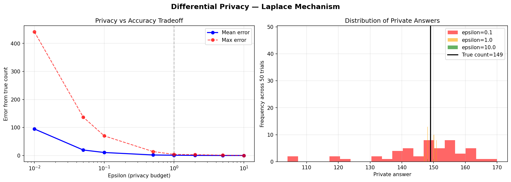

# Differential Privacy: Laplace Mechanism

A simulation of differential privacy using the Laplace mechanism, 
applied to a synthetic healthcare dataset. Explores how the privacy 
budget epsilon controls the tradeoff between privacy and accuracy.

## Core Idea

Differential privacy adds calibrated random noise to query answers 
so that no individual's data can be identified from the output. The 
key insight is that the noise is mathematically guaranteed so an 
attacker cannot determine whether any specific person is in the 
dataset.

The privacy budget epsilon controls the tradeoff:
- Small epsilon = strong privacy, large noise, less accurate results
- Large epsilon = weak privacy, small noise, more accurate results

## Key Findings



- At epsilon=0.01: mean error of 94.6 - strong privacy but 
  completely unusable results
- At epsilon=1.0: mean error of 1.0 - reasonable accuracy with 
  meaningful privacy protection
- Sharp knee in the curve between epsilon=0.5 and 1.0 — this is 
  the practical sweet spot for real deployments
- Beyond epsilon=5.0: near-perfect accuracy but negligible 
  privacy guarantee

## Architecture
dp.py           - Laplace mechanism, count queries, private queries
simulation.py   - generates synthetic patient dataset, runs experiments across epsilon values
main.py         - entry point, plots privacy-accuracy tradeoff and distribution of private answers

## The Math
noise = Laplace(0, sensitivity / epsilon)
private_answer = true_answer + noise
Sensitivity = maximum change one person can cause in the query 
result. For count queries, sensitivity = 1.

## Setup

```bash
python3 -m venv venv && source venv/bin/activate
pip install numpy matplotlib
python main.py
```

## Connection to Research

Differential privacy is foundational to privacy-preserving machine 
learning, the same epsilon-sensitivity framework applies when 
training ML models on sensitive data. This simulation explores the 
core mechanism before applying it to model training contexts.

## Future Work

- Gaussian mechanism as an alternative to Laplace
- Composition theorems; how privacy budget degrades across multiple queries
- Apply differential privacy to federated learning aggregation
- Test on real anonymized datasets
